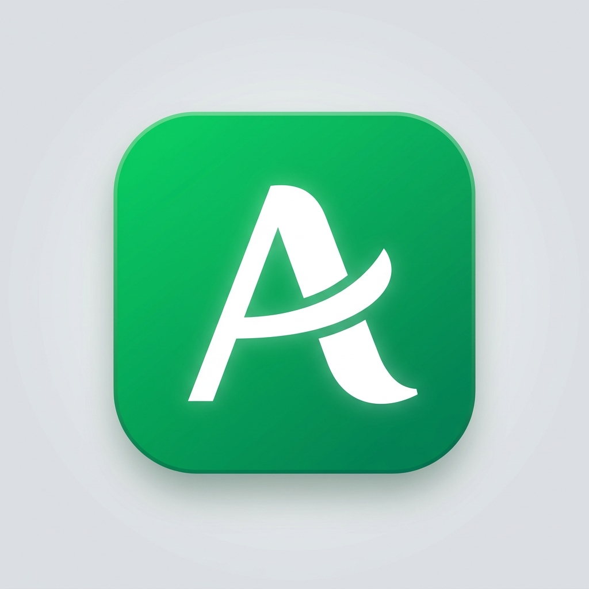

<p align="center">
  
</p>

<p align="center">
  
  
  
  
  
  
</p>

<h1 align="center">Atelier-MCP</h1>

<p align="center">
  <strong>Design tools for AI that actually understand your project.</strong><br/>
  <sub>An MCP server that gives coding assistants real design superpowers — project inspection, motion recipes, structured planning, safe rollbacks, and accessibility auditing. No vibes-based CSS. No guessing.</sub>
</p>

---

## The problem

You ask an AI to "make the hero section look better" and it dumps 200 lines of
arbitrary CSS, overwrites your design tokens, ignores your existing component
library, and produces something that looks like every other AI-generated site.

Atelier fixes that.

## What this actually does

Atelier MCP sits between your AI coding assistant and your frontend project as
an [MCP server](https://modelcontextprotocol.io). It exposes **10 tools** that
give the AI structured context about your project *before* it touches anything:

```
Your AI assistant
      │
      ▼
  ┌──────────────┐     inspect → understand tokens, components, conventions
  │  Atelier MCP │     search  → find recipes that match the project's aesthetic
  │   (stdio)    │     plan    → structured changes with rollback capability
  └──────────────┘     apply   → safe changes with automatic backups
      │
      ▼
  Your website project
```

The AI inspects first, consults a curated recipe catalog, builds a plan, and
only then makes changes — with backups so you can undo everything.

## One-line install

**macOS / Linux:**
```bash
curl -fsSL https://raw.githubusercontent.com/YOUR_USERNAME/atelier-mcp/main/install.sh | bash
```

**Windows (PowerShell):**
```powershell
irm https://raw.githubusercontent.com/YOUR_USERNAME/atelier-mcp/main/install.ps1 | iex
```

Both scripts check prerequisites (Node 20.19+ (20.x) or 22.12+, Git), clone the repo, install
dependencies, build, and drop the `atelier` CLI onto your PATH. Done.

## Quickstart

```bash
# clone it
git clone https://github.com/YOUR_USERNAME/UiMCP.git
cd UiMCP

# install
npm install

# build everything
npm run build

# install into your website project
npx tsx packages/cli/src/cli.ts install --source . /path/to/your/site

# or just run the MCP server directly for debugging
npm run dev:server
```

### Hook it up to Claude Code

```bash
claude mcp add atelier-mcp -- npx tsx /path/to/atelier-mcp/packages/server/src/index.ts
```

That's it. Your AI now has design tools.

## Monorepo layout

```
.
├── packages/
│   ├── server/       →  the MCP server itself (10 tools over stdio)
│   ├── cli/          →  install/uninstall/doctor/update commands
│   ├── recipes/      →  curated design & motion recipe catalog
│   ├── adapters/     →  framework detection (React+Vite, Next.js)
│   └── monitor/      →  Neurolink web dashboard (real-time visualizer)
│
├── install.sh        →  one-line installer (macOS/Linux)
├── install.ps1       →  one-line installer (Windows)
├── LICENSE           →  MIT
├── THIRD_PARTY_LICENSES.md
└── package.json      →  npm workspaces monorepo root
```

## The tools

| Tool | What it does |
|:-----|:-------------|
| `inspect_project` | Reads your project — framework, components, design tokens, config files, existing conventions. The AI calls this first. |
| `search_recipes` | Searches a curated catalog of motion & UI patterns by purpose, aesthetic, framework, or performance cost. |
| `get_recipe` | Returns full implementation code for a recipe — React component, CSS, dependencies, a11y metadata, license info. |
| `prepare_design` | Creates a structured plan: design direction, tokens, selected recipes, and exact file changes. Persisted to disk. |
| `preview_changes` | Shows what would change before anything is written. Detects conflicts, lists dependencies. |
| `apply_changes` | Writes the files. Backs up everything it touches. Returns a record ID for rollback. |
| `rollback_changes` | Reverts Atelier changes. Detects if you've edited files since and warns before overwriting. |
| `capture_preview` | Screenshots your running site at mobile/tablet/desktop via Playwright. |
| `audit_ui` | Runs accessibility checks (axe-core), Lighthouse performance, and contrast validation. |
| `monitor_project` | Event log and session state — what tools were called, what changed, project dependency graph. |

## Recipe catalog

The recipe catalog isn't just "here's some CSS." Each recipe ships with:

- **Full React component code** for both Vite and Next.js
- **Accessibility story** — keyboard, touch, screen reader, `prefers-reduced-motion`
- **Performance budget** — JS size, CSS size, GPU needs, expected FPS
- **License** — know exactly what you're shipping
- **Parameters** — every recipe is configurable, not copy-paste-and-pray

Current categories:

| Category | Examples |
|:---------|:---------|
| Text reveals | Split text, per-word stagger, line-by-line |
| Entrances | Staggered grid cascade, fade-scale-in |
| Buttons | Tactile press feedback, ripple effects |
| Hover effects | Perspective tilt card, magnetic cursor |
| Dialogs & menus | Accessible modal with focus trap, slide panels |
| Route transitions | Cross-fade, slide, scale between pages |
| Scroll progress | Reading progress bar |
| Parallax | Restrained depth layers (not the 2014 kind) |
| Sticky storytelling | Scroll-pinned narrative sections |

## CLI

```bash
atelier install [dir]        # Install Atelier into a project
atelier uninstall [dir]      # Clean removal
atelier doctor [dir]         # Health check
atelier update [dir]         # Update source reference
atelier serve                # Run MCP server directly
```

Install flags:

```
--source <path>     Local Atelier source directory
--repo <url>        Clone from a git repo instead
--ref <ref>         Specific branch/tag/commit
--dry-run           See what would happen
--skip-mcp          Don't auto-configure MCP client
--skip-skill        Don't install CLAUDE.md companion file
```

## How it stays safe

1. **Never writes without a plan.** The AI must call `prepare_design` → `preview_changes` → `apply_changes`. No yolo file writes.
2. **Backs up everything it touches.** Every modified file gets a backup in `.atelier/backups/`.
3. **Rollback is first-class.** `rollback_changes` restores backups and detects user edits made after Atelier's changes.
4. **Path validation.** All file operations are sandboxed to the project directory. No traversal escapes.
5. **Respects what's already there.** `inspect_project` reads existing tokens, conventions, and component patterns so the AI doesn't bulldoze your design system.

## Development

```bash
npm run typecheck        # type checking across all packages
npm run lint             # ESLint across source and tests
npm test                 # vitest
npm run dev:server       # watch mode on the MCP server
```

## Supported frameworks

- **React + Vite** (≥18.0)
- **Next.js** (≥14.0, App Router)

More coming. PRs welcome.

## Neurolink Monitor

A responsive, dark dashboard for watching Atelier in action. Requires Node.js
20.19+ (20.x) or 22.12+ for the development toolchain.

```bash
# Start the monitor
npm run dev:monitor -- --project /path/to/your/site

# Open http://localhost:4510
# Use --port 4511 to choose a different port
```

What you get:
- **Overview** — Project metrics, an interactive tool map, recent activity, and plans.
- **Activity** — Search and filter the latest 200 events; pause the feed to inspect details.
- **Project** — Framework, dependencies, components, design tokens, and configuration files.
- **Design plans** — Review saved plans, status, file changes, and related change records.
- **Tool library** — Explore all ten tools, their purpose, and recent calls.
- **Snapshot export** — Download the current workspace data as JSON.

The monitor connects locally, reconnects automatically, and displays errors when
data cannot be refreshed. Project-specific MCP events are read from the project's
`.atelier/events/` directory. Use the same project path in your coding assistant
and monitor to see its activity. Press `/` to search and `?` for the workflow guide.
Motion respects the system's reduced-motion preference.

For the optional MCP screenshot and browser audit tools, install Chromium once:

```bash
npx playwright install chromium
```

## License

This project is dual-licensed. Pick whichever works for you:

- **MIT** — [LICENSE-MIT](./LICENSE-MIT)
- **Apache 2.0** — [LICENSE-APACHE](./LICENSE-APACHE)
- **Blue Oak 1.0.0** — [LICENSE-BLUEOAK](./LICENSE-BLUEOAK) (covers bundled dependencies from `glob`)

Third-party dependency licenses are fully documented in
[THIRD_PARTY_LICENSES.md](./THIRD_PARTY_LICENSES.md).
